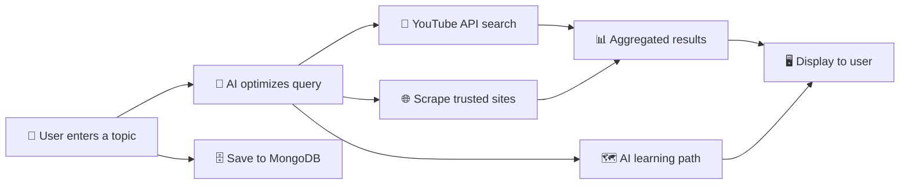

<div align="center">

# 📚 Tutorial Finder — AI-Powered Learning Discovery

**Find the best tutorials, courses, and learning resources in seconds.**

[](https://python.org)
[](https://flask.palletsprojects.com)
[](https://openai.com)
[](https://mongodb.com)
[](https://render.com)

[Live Demo](#) · [Features](#-features) · [Getting Started](#-getting-started) · [Deploy](#-deployment)

</div>

---

## 🔍 What is Tutorial Finder?

Tutorial Finder is an AI-powered web application that helps students and self-learners discover the **best tutorials, courses, and blog-based resources** across the internet — all from a single search.

Instead of manually browsing YouTube, freeCodeCamp, Udemy, Coursera, and edX separately, Tutorial Finder aggregates results from all of them and uses **AI to optimize your search** and generate a **personalized learning path** — saving you hours of research time.

---

## ✨ Features

| Feature | Description |
|---|---|
| 🎥 **YouTube Tutorial Search** | Searches YouTube using the Data API v3 with filters for duration, sort order, and domain |
| 🌐 **Multi-Platform Scraping** | Scrapes results from freeCodeCamp, Udemy, Coursera, and edX |
| 🤖 **AI Query Optimization** | Uses GPT-3.5 (via LangChain) to convert vague queries into precise search terms |
| 🗺️ **AI Learning Path** | Generates a concise, structured learning roadmap based on your topic |
| 🗄️ **Search History** | Saves search queries to MongoDB for analytics and future improvements |
| 🎨 **Modern UI** | Clean, responsive interface designed for beginners and learners |

---

## 📸 Screenshots

### 🏠 Landing Page
> Clean, intuitive interface for beginners and learners to get started instantly.


### 🔎 Smart Search with Domain Filter
> Enter any topic and select a domain to get targeted tutorial results.


### 📺 YouTube Tutorial Results
> Curated YouTube tutorials with thumbnails, channel info, and direct links.


### 📝 Blog-Based Learning Resources
> Additional articles and courses from freeCodeCamp, Udemy, Coursera, and edX.


---

## 🏗️ Project Architecture

```
Tutorial_finder/
├── app.py                  # Flask application entry point & routes
├── config.py               # Environment-based configuration
├── requirements.txt        # Python dependencies
├── .python-version         # Python version for deployment (3.11.6)
├── .env                    # Environment variables (not committed)
│
├── utils/
│   ├── youtube_api.py      # YouTube Data API v3 integration
│   ├── scraper.py          # BeautifulSoup web scraper for trusted sites
│   ├── ai_helper.py        # LangChain + OpenAI query optimization & learning paths
│   └── db.py               # MongoDB connection & search history storage
│
├── templates/
│   ├── base.html           # Base Jinja2 template with shared layout
│   ├── index.html          # Landing / Home page
│   └── search.html         # Search results page
│
└── static/
    ├── css/                # Stylesheets
    └── js/                 # Client-side JavaScript
```

---

## ⚙️ How It Works



1. **User Input** — User enters a topic (e.g., "machine learning") and optionally selects a domain and filters.
2. **AI Optimization** — GPT-3.5 refines the query into an optimized search phrase for better results.
3. **YouTube Search** — The YouTube Data API v3 fetches relevant video tutorials with metadata.
4. **Web Scraping** — BeautifulSoup scrapes results from freeCodeCamp, Udemy, Coursera, and edX.
5. **Learning Path** — AI generates a personalized, structured learning roadmap.
6. **Results Display** — All results are aggregated and displayed on a single page.
7. **History Saved** — The search query is saved to MongoDB for analytics.

---

## 🚀 Getting Started

### Prerequisites

- **Python 3.11+**
- **MongoDB** (local or [MongoDB Atlas](https://www.mongodb.com/atlas) cloud)
- **YouTube Data API Key** — [Get one here](https://console.cloud.google.com/apis/credentials)
- **OpenAI API Key** *(optional, for AI features)* — [Get one here](https://platform.openai.com/api-keys)

### 1️⃣ Clone the Repository

```bash
git clone https://github.com/Amarjeet9305/Tutorial_finder.git
cd Tutorial_finder
```

### 2️⃣ Create a Virtual Environment

```bash
python -m venv venv

# Windows
venv\Scripts\activate

# macOS / Linux
source venv/bin/activate
```

### 3️⃣ Install Dependencies

```bash
pip install -r requirements.txt
```

### 4️⃣ Set Up Environment Variables

Create a `.env` file in the project root:

```env
YOUTUBE_API_KEY=your-youtube-api-key
OPENAI_API_KEY=your-openai-api-key        # Optional — AI features degrade gracefully without it
MONGO_URI=mongodb://localhost:27017/Tutorial.ai
SECRET_KEY=your-secret-key
```

### 5️⃣ Run the Application

```bash
python app.py
```

Open your browser and navigate to **http://127.0.0.1:5000** 🎉

---

## 🌐 Deployment

### Deploy on Render

1. Push your code to GitHub.
2. Go to [render.com](https://render.com) → **New Web Service** → Connect your GitHub repo.
3. Configure the service:

   | Setting | Value |
   |---|---|
   | **Build Command** | `pip install -r requirements.txt` |
   | **Start Command** | `gunicorn app:app` |
   | **Python Version** | Auto-detected from `.python-version` (3.11.6) |

4. Add **Environment Variables** in the Render dashboard:
   - `YOUTUBE_API_KEY`
   - `OPENAI_API_KEY` *(optional)*
   - `MONGO_URI` *(use MongoDB Atlas for production)*
   - `SECRET_KEY`

5. Click **Deploy** — your app will be live! 🚀

> **Note:** The `.python-version` file ensures Render uses the correct Python version automatically.

---

## 🛠️ Tech Stack

| Layer | Technology |
|---|---|
| **Backend** | Flask 2.3, Python 3.11 |
| **AI / LLM** | OpenAI GPT-3.5 via LangChain |
| **Video API** | YouTube Data API v3 |
| **Web Scraping** | BeautifulSoup4, Requests |
| **Database** | MongoDB (PyMongo) |
| **Frontend** | Jinja2 Templates, HTML/CSS/JS |
| **Deployment** | Render, Gunicorn |

---

## 🤝 Contributing

Contributions are welcome! Here's how to get involved:

1. **Fork** the repository
2. **Create** a feature branch: `git checkout -b feature/amazing-feature`
3. **Commit** your changes: `git commit -m "Add amazing feature"`
4. **Push** to the branch: `git push origin feature/amazing-feature`
5. **Open** a Pull Request

---

## 📄 License

This project is open source and available under the [MIT License](LICENSE).

---

<div align="center">

**Made with ❤️ by [Amarjeet](https://github.com/Amarjeet9305) — saving your time and helping you find the best tutorials! 📚🚀**

</div>
